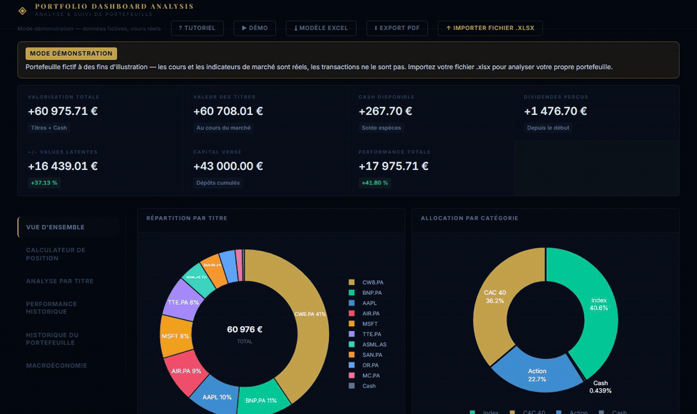
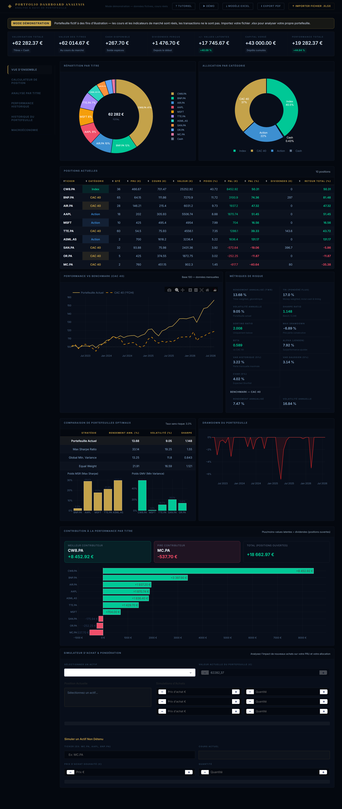
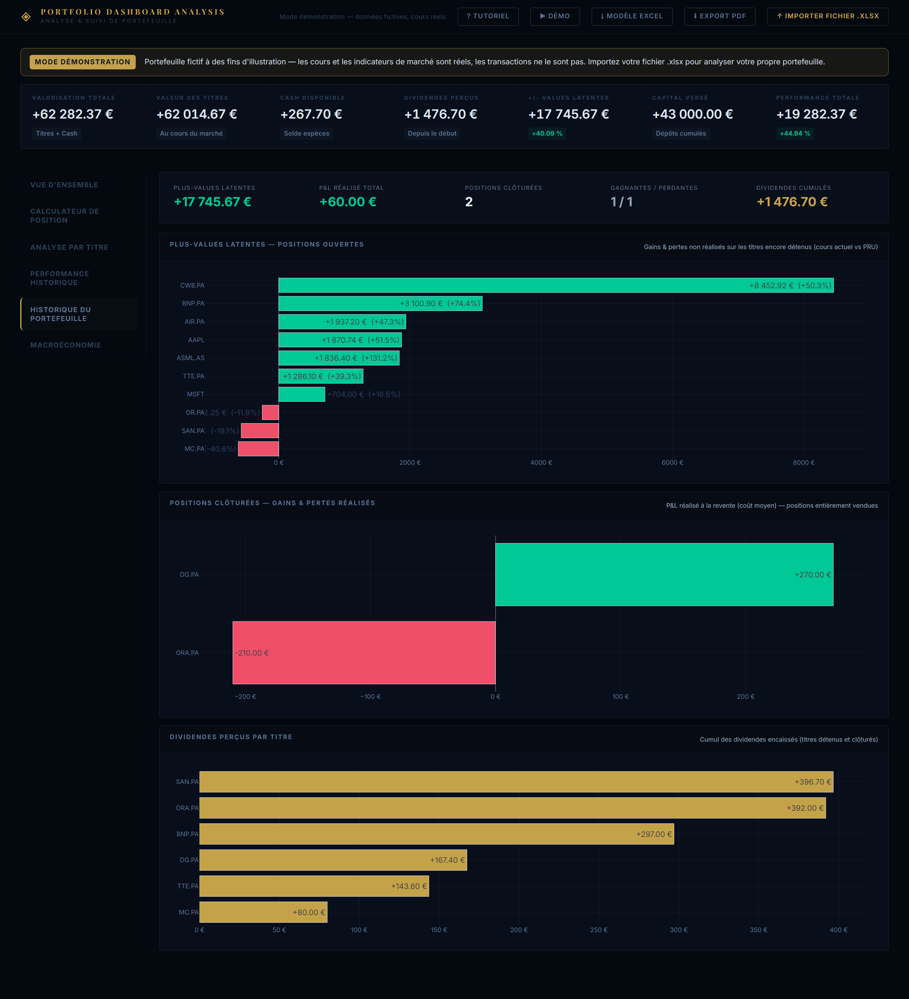
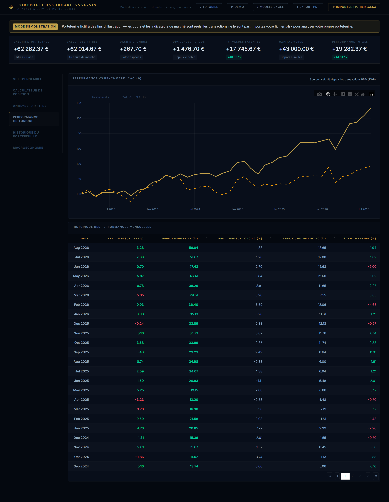
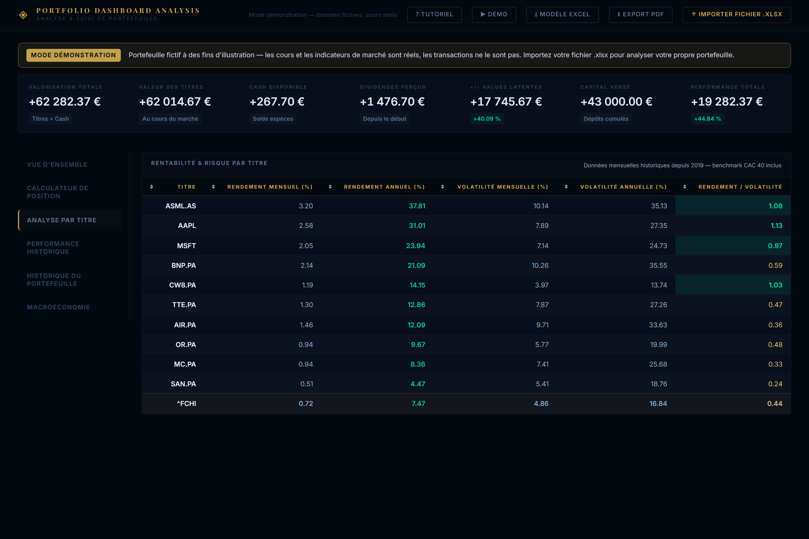
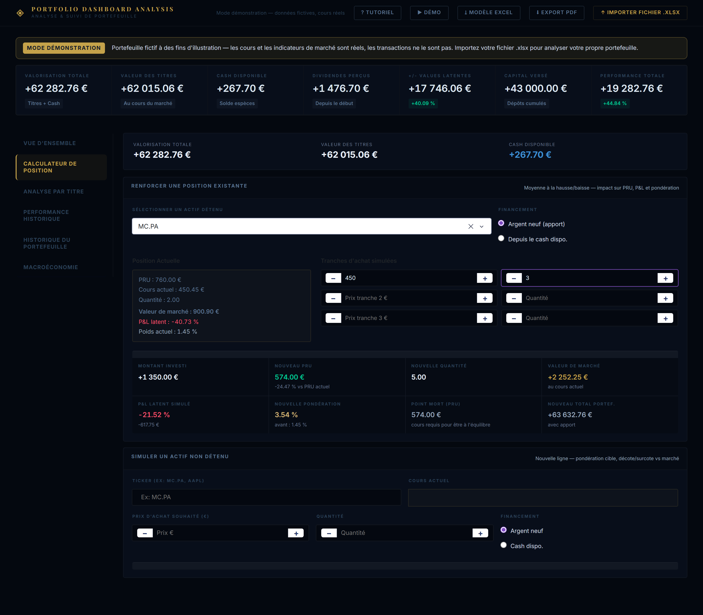
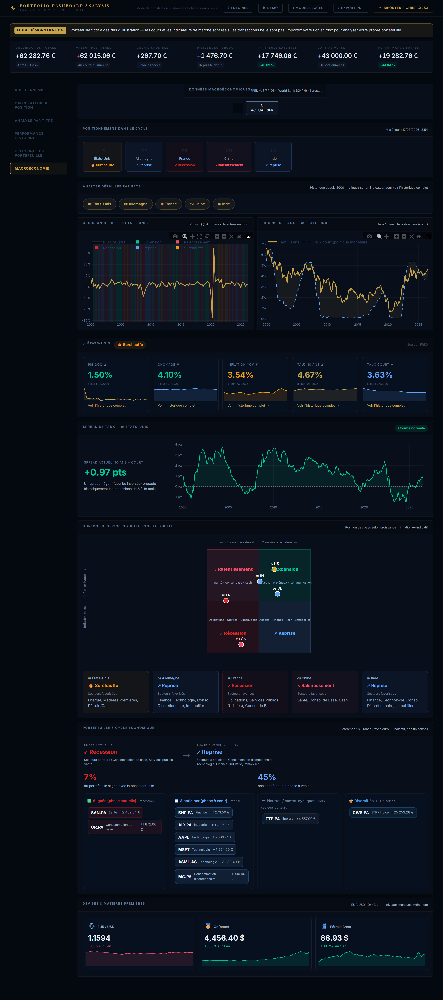

# 📊 Portfolio Dashboard

Tableau de bord interactif de **suivi et d'analyse de portefeuille boursier**, construit avec [Dash](https://dash.plotly.com/). Importez votre historique de transactions Excel et obtenez instantanément la valorisation, la performance, les indicateurs de risque, l'allocation, la macroéconomie et un simulateur d'achat — le tout avec des cours de marché réels.

> 🔒 **Vos données restent chez vous.** Le fichier de transactions est traité en mémoire à chaque session ; rien n'est enregistré côté serveur.

---

## 🖼️ Aperçu

> Les captures ci-dessous utilisent le **mode démonstration** : un portefeuille fictif avec des cours de marché réels. Aucune donnée personnelle.

### Tour rapide



### Vue d'ensemble
Valorisation, allocation, positions, performance vs CAC 40, indicateurs de risque, portefeuilles optimaux et simulateur d'achat.



### Historique du portefeuille
Plus-values latentes des positions ouvertes, gains/pertes réalisés des positions clôturées, dividendes perçus par titre.



### Performance historique
Courbe du portefeuille vs CAC 40 (base 100) et détail mensuel.



### Analyse par titre &nbsp;·&nbsp; Calculateur de position &nbsp;·&nbsp; Macroéconomie

| Analyse par titre | Calculateur de position | Macroéconomie |
|:---:|:---:|:---:|
|  |  |  |

---

## ✨ Fonctionnalités

- **Vue d'ensemble** — valorisation, capital versé, cash, plus-values latentes, performance totale ; table des positions, répartition par titre et par catégorie.
- **Performance vs benchmark** — comparaison au CAC 40 (base 100), calculée en **TWR** (Time-Weighted Return) depuis l'historique réel des transactions, plus le **TRI / rendement money-weighted (XIRR)**.
- **Indicateurs de risque** — Sharpe, Sortino, Max Drawdown, VaR / CVaR, Bêta et Alpha vs CAC 40.
- **Analyse par titre** — rendement et volatilité (mensuels / annualisés) par ligne.
- **Portefeuilles optimaux** — comparaison MSR (Max Sharpe), GMV (variance minimale) et équipondéré (optimisation SLSQP).
- **Calculateur de position** — simulez des renforts, calcul du nouveau PRU, point mort, décote/surcote et poids résultant.
- **Historique du portefeuille** — plus-values latentes des positions ouvertes, gains/pertes réalisés des positions clôturées, dividendes perçus par titre.
- **Macroéconomie** — PIB, inflation, chômage, taux (US, France, Allemagne, Chine, Inde) via FRED, Eurostat et World Bank.
- **Export PDF** et **modèle Excel** téléchargeable.
- **Mode démonstration** — un portefeuille fictif (cours réels) pour explorer l'outil sans transmettre de données.

---

## 🚀 Démarrage rapide

### Prérequis
- Python 3.11+

### Installation

```bash
git clone https://github.com/STAKHAN-M/Portfolio_advisory.git
cd Portfolio_advisory
pip install -r requirements.txt
```

### Configuration (optionnelle)

L'onglet **Macroéconomie** utilise l'API [FRED](https://fred.stlouisfed.org/docs/api/api_key.html) (clé gratuite). Copiez le modèle d'environnement et renseignez votre clé :

```bash
cp .env.example .env
# puis éditez .env : FRED_API_KEY=votre_cle
```

> La clé FRED peut aussi être saisie directement dans l'interface. Sans clé, le reste du tableau de bord (positions, performance, risque) fonctionne normalement grâce à `yfinance`.

### Lancement

```bash
python app.py
```

Ouvrez ensuite **http://127.0.0.1:8050**. Cliquez sur **« ▶ Démo »** pour un aperçu immédiat, ou importez votre fichier `.xlsx`.

---

## 📁 Format des données

Le fichier attendu est un classeur Excel `.xlsx` avec une feuille **`BDD`** (obligatoire) :

| Colonne | Description |
|---|---|
| `Date` | Date de l'opération (AAAA-MM-JJ) |
| `Type` | `Achat`, `Vente`, `Dividende` ou `Versement` |
| `Ticker` | Symbole Yahoo Finance (ex. `MC.PA`, `AAPL`) — vide pour un `Versement` |
| `Description_Operation` | Libellé libre (facultatif) |
| `Quantite` | Nombre de titres (0 pour Versement / Dividende) |
| `Prix_Unitaire` | Prix par titre |
| `Montant_Total` | Montant brut de l'opération |
| `Cash_Flow` | Flux de trésorerie : **négatif** pour un Achat, **positif** pour Vente / Dividende / Versement |

Une feuille **`Valorisation`** (facultative) permet d'utiliser des instantanés mensuels pour la courbe de performance ; sinon celle-ci est reconstituée en TWR depuis la feuille `BDD`.

👉 Téléchargez un **modèle pré-rempli** directement depuis l'interface (bouton « ⤓ Modèle Excel »).

---

## 🏗️ Architecture

```
app.py            → interface Dash (layout, callbacks, mise en forme)
  └─ engine.py    → couche données & analytics du dashboard (yfinance, TWR, XIRR, optimisation)
  └─ macro_engine.py → données macro (FRED / Eurostat / World Bank)
  └─ demo_data.py → portefeuille de démonstration (données fictives, cours réels)
  └─ pdf_report.py → export PDF

Modelling_Portfolio.py → script autonome d'optimisation (PyPortfolioOpt + Excel via xlwings)
  └─ Portfolio_functions.py → utilitaires (fondamentaux via l'API FMP)
```

`app.py` ne dépend que de `engine.py` et `macro_engine.py` ; l'état circule entre callbacks via des composants `dcc.Store`. Le script `Modelling_Portfolio.py` est indépendant du dashboard.

---

## ☁️ Déploiement

Le projet est prêt pour un déploiement gratuit sur [Render](https://render.com) (`render.yaml` et `Procfile` inclus). Voir **[DEPLOY.md](DEPLOY.md)** pour le pas-à-pas. Définissez `FRED_API_KEY` (et éventuellement `FMP_API_KEY`) dans les variables d'environnement du service.

---

## 🔐 Sécurité & confidentialité

- Aucune clé API n'est stockée dans le code : tout est lu depuis des variables d'environnement (voir `.env.example`).
- `.env` et les fichiers de données personnels (`*.xlsx`, `*.xlsm`, `*.csv`) sont exclus par `.gitignore`.
- Les transactions importées sont traitées en mémoire pour la session : aucune donnée personnelle n'est persistée côté serveur.

---

## 🛠️ Stack technique

Dash · Plotly · pandas · NumPy · SciPy · yfinance · PyPortfolioOpt · ReportLab · Gunicorn

---

## ⚠️ Avertissement

Ce projet est un outil d'analyse à visée éducative et personnelle. Il ne constitue **pas un conseil en investissement**. Les données de marché proviennent de sources tierces et peuvent comporter des erreurs ou des retards.

## 📄 Licence

Distribué sous licence MIT. Voir [`LICENSE`](LICENSE).
